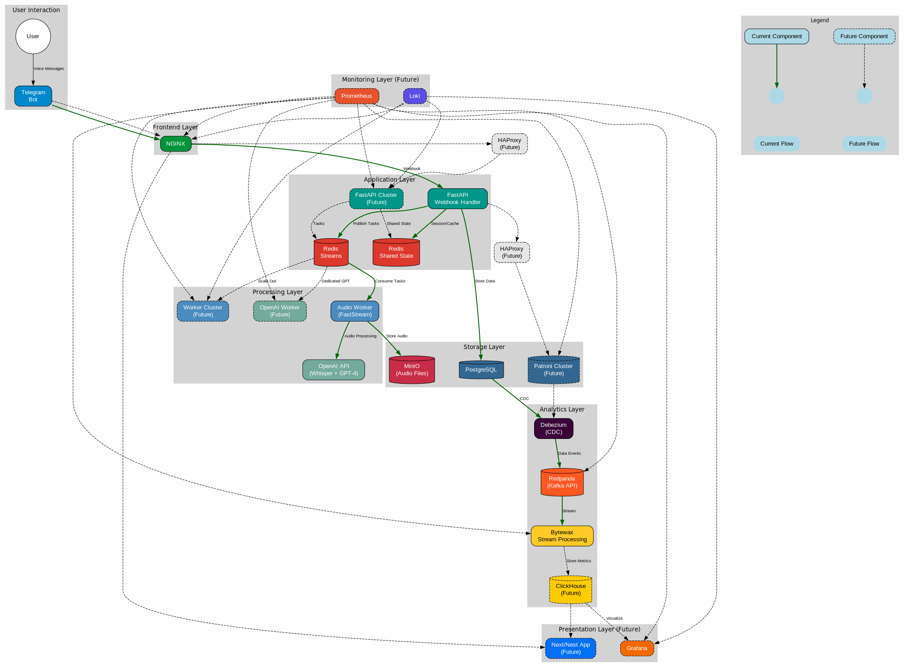

# 🗣️ Speech Coach

**Speech Coach** is a Telegram-based assistant for practicing spoken English, with automatic feedback, speech recognition, and real-time progress tracking.

## 👨‍💻 About the Project

Originally built by [Alexander Kim](https://www.linkedin.com/in/aksovius) as a personal tool to prepare for TOEFL speaking tasks and job interviews, **Speech Coach** has grown into a robust portfolio project. It demonstrates skills in backend development, real-time data pipelines, infrastructure automation, and AI integration.

Beyond individual practice, the project is designed with **language learning analytics** in mind — and can support academic research on speech development and learner progress. Its modular architecture allows for future expansions, including dashboards, experiment tracking, and collaborative study tools.


## 🏗️ System Architecture



Speech Coach uses a microservices architecture with three main components:

- **FastAPI Application**: Handles web requests and Telegram webhooks
- **Worker Service**: Processes audio files and generates feedback using OpenAI APIs
- **Analytics Pipeline**: Analyzes usage patterns and generates metrics

The services communicate through:
- **Redis Streams**: For business logic and task coordination between the app and workers
- **Redpanda (Kafka API)**: For analytics data flow with CDC from PostgreSQL to Bytewax

This separation allows for independent scaling of components and clear separation of concerns.

## ✨ Key Features

- Sends speaking prompts to the user (currently focused on TOEFL Speaking Task 1)
- Users respond via voice message in Telegram
- Converts speech to text using OpenAI Whisper
- Provides automatic feedback, score, and example improvements using GPT-4
- Stores responses and metrics for long-term tracking
- Real-time analytics with sliding window analysis for performance trends

## ⚙️ Tech Stack

Speech Coach is built using production-grade tools and modern data infrastructure, including real-time processing and distributed systems.

### 💻 Backend
- **FastAPI** – Web server + Telegram webhook handler
- **FastStream** – Audio processing pipeline over Redis Stream
- **PostgreSQL** – Persistent storage for users, questions, and answers
- **MinIO** – Object storage for voice message audio files

### 🔊 Audio Processing
- **OpenAI API** – Speech-to-text (Whisper) and feedback generation (GPT-4)
- **Bytewax** – Real-time stream processing: counts, sliding windows, metrics
- **Redpanda + Debezium** – CDC from PostgreSQL → Redpanda stream → Bytewax

### 🛠️ Infrastructure
- **Docker + docker-compose** – Local and dev deployment
- **HAProxy, Patroni** – Planned high availability for PostgreSQL
- **Ansible** – Partial setup automation (in progress)
- **Terraform** – Early groundwork included for future infrastructure-as-code

## 🔄 Scaling Considerations

The system is designed with scalability in mind:

- **API Layer**: Multiple FastAPI instances can be deployed behind HAProxy with shared state in Redis
- **Worker Layer**: Audio processing workers can be horizontally scaled to handle increased load
- **Database Layer**: Patroni provides HA capabilities for PostgreSQL
- **Bottleneck Mitigation**: OpenAI API transcription processing is the current bottleneck - addressed through worker pool scaling

## 🚀 Getting Started

> ⚠️ Full installation guide coming soon. Currently, local deployment works via Docker Compose.

```bash
git clone https://github.com/aksovius/speech-coach.git
cd speech-coach
docker-compose up --build
```

> The Telegram bot can be tested manually once the server is running. Automatic registration and demo scripts are planned.

## 🧪 Testing Approach

Testing a distributed system presents unique challenges. Our approach focuses on:

- **E2E Tests**: Ensuring data flows correctly through the entire system
- **Component Tests**: Validating individual services in isolation
- **Integration Tests**: Verifying connections between adjacent services
- **Performance Testing**: Identifying bottlenecks under load

## 🧠 Technical Challenges Overcome

This project presented several interesting technical challenges:

1. **Webhook Handling**: Managing Telegram webhooks with multiple FastAPI instances required shared state and careful coordination
2. **Stream Processing**: Adapting from Kafka/Flink experience to Bytewax/Redpanda required learning new patterns while applying familiar concepts
3. **Audio Processing Pipeline**: Building a reliable pipeline for handling voice messages with appropriate error handling and retries
4. **AI Integration**: Balancing response time and accuracy with OpenAI API rate limits and costs

## 🔭 Roadmap
[Roadmap](docs/roadmap.md)

## 📚 Documentation

A dedicated documentation site is under development using Docusaurus. For now, check the [`docs/`](./docs/) folder for architecture, roadmap, and design notes.

## 🤝 About the Creator

I’m Alexander Kim — a software engineer passionate about language, data, and scalable systems. I built Speech Coach to combine my interests in microservices, stream processing, and education technology.

Let’s connect on [LinkedIn](https://www.linkedin.com/in/aksovius) or [Telegram](https://t.me/aksovius) — I’m always open to collaboration, feedback, or new opportunities.

## ⚠️ Disclaimer

This is a work in progress. Some parts are experimental or incomplete. Use at your own risk 😊
